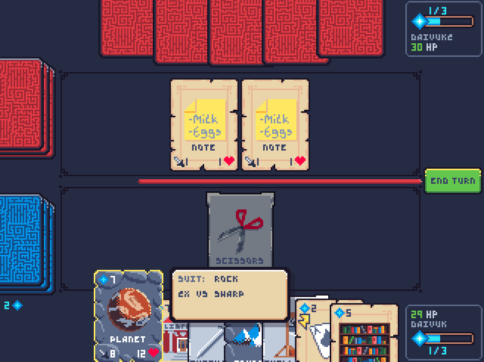
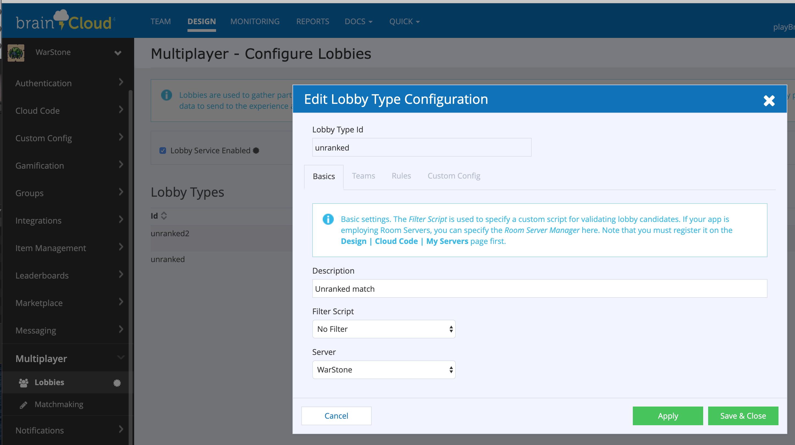
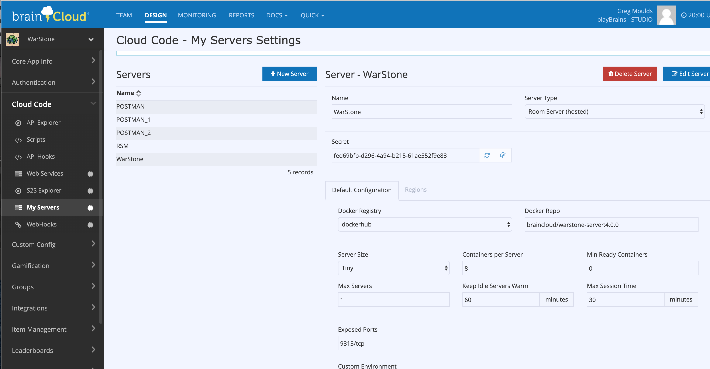
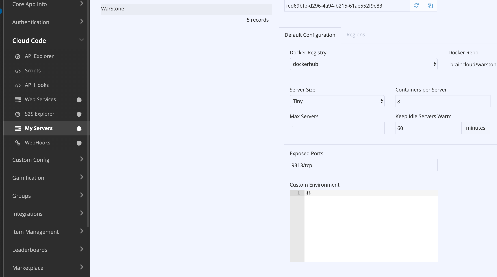

# Warstone
Warstone is a turn-based card game built using the brainCloud real-time Matchmaking facilities.

Of note, there are 2 versions of the server-side source for this game: a Room Server (RS) based approach and a Room Server Manager (RSM) based approach. 

The RS approach takes advantage of the built-in brainCloud hosted infrastructure and runs Room Server instances (provided via a Docker image) for each match.

The RSM approach takes advantage of the built-in brainCloud facility to talk to an external Room Server Manager for spinning up match instances.

The RS approach is the simpler of the two scenarios while the RSM version is slightly more complex but particularly useful if you or your company already have infrastructure in place for running server instances (i.e. you want to host your own Room Server instances).

The following sections describe the protocols and requirements for the RS approach. The RSM approach will be described in a separate article.

## How matchmaking works
Room Server instances in brainCloud are launched when the matchmaking requirements are satified for a particular lobby instance. Lobby matchmaking details are outside the scope of this article however you can find them [here](https://getbraincloud.com/apidocs/api-modules/multiplayer/lobbies/) if you haven't been exposed to it before.

Assuming a player (or players) have been assigned to a lobby instance (typically via the Lobby service FindOrCreateLobby() API call) and the launch criteria have been satisfied for that lobby instance (ex. all the players are "ready") then the next step for brainCloud is to spin up a Room Server instance for those players. How brainCloud does this is determined by the configuration of the corresponding lobby type.

In our Warstone example, our lobby type is called "unranked" and it maps to a Server type called appropriately enough... "WarStone":

The definition of the "WarStone" server type looks like this:

The significant setting for our purposes here is that of the "WarStone" Server Type. It is set to *Room Server (hosted)*. This corresponds to the RS approach of matchmaking. (If the type were *Room Server Manager* then that would correspond to the RSM approach of launching room server instances.)

## Room Server launch protocol
When it comes time for brainCloud to launch a Room Server instance, the internal brainCloud Room Server Manager will do so by following these basic steps:

1. Assign a short random one-time password for each lobby member.
2. Pull the configured docker image from the docker registry.
3. Start an instance of the image in docker and set [various environment variables](#room-server-instance-environment-variables) to communicate relevant data to the instance.
4. Wait for the RS instance to indicate that it's ready to accept client connections. This is accomplished by the RS instance calling [SysRoomReady](https://getbraincloud.com/apidocs/apiref/#s2s-lobby-sysroomready) via the brainCloud S2S interface.
5. Upon receipt of the SysRoomReady call, the brainCloud lobby service sends an RTT message to all the lobby members indicating the instance is ready and they should connect to it.
6. The lobby instance is DISBANDED with a message stating "Room successfully launched". The lobby service does not wait to validate whether everybody connected or not before disbanding the lobby instance.
7. Lobby members connect to the RS instance directly. The RS instance can validate the connection requests using the one-time passwords generated in step 1.

## Room Server instance environment variables
The following environment variables are set for each RS instance:

* APP_ID -- The brainCloud app id.
* EXTERNAL_IP -- The external ip of this room server instance.
* LOBBY_ID -- The lobby instance id this room server instance corresponds to.
* SERVER_HOST -- The host to call for S2S requests.
* SERVER_PORT -- The port to call for S2S requests.
* SERVER_NAME -- The name of the "My Servers" entry that corresponds to this RS instance.
* SERVER_SECRET -- The secret for the "My Servers" entry that corresponds to this RS instance.

In addition to these values, any custom values defined in the "Custom Environment" section of the "My Servers" section for this server type will also be set.

## Room Server instance development
As a Room Server instance developer, you can use the S2S [Logging](https://getbraincloud.com/apidocs/apiref/#s2s-log) interface to log any debugging or info level messages to aid you when developing the Room Server instance docker image.
